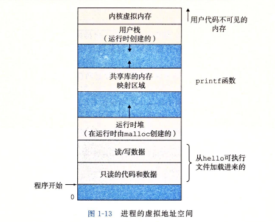

# 操作系统篇

* **系统硬件**
* 总线：各部件传递信息字节的通道
* IO设备：与IO总线相连，系统与外界联系的通道，如键盘鼠标、显示器、磁盘等
* 主存：临时存储设备，存放处理器执行时的程序和数据，由动态随机存取存储器组成
* 处理器：CPU，解释存储在主存的指令的引擎，核心为寄存器

**存储器：** 


存储器层次结构主要是上一层的存储器作为低一层存储器的高速缓存，寄存器文件是L1的高速缓存，L1是L2的高速缓存，L2是L3的高速缓存，L3=&gt;主存，主存=&gt;磁盘。


操作系统文件是对IO设备的抽象，虚拟内存是对主存和磁盘IO设备的抽象，进程是对处理器、主存、IO设备的抽象。



* **程序代码和数据**：对所有的进程来说，代码是从同一固定地址开始的。代码和数据区是直接按照可执行目标文件的内容初始化，运行时指定了大小
* **堆**：代码和数据区后紧随着的是运行时堆，它可以在运行时动态地扩展和收缩
* **共享库**：中间部分用来存放共享库的代码和数据的区域
* **栈**：位于用户虚拟地址空间顶部，编译器用它来实现函数调用，也可以动态地扩展和收缩
* **内核虚拟内存**：地址空间顶部的区域，不允许应用程序读写这个区域的内容或直接调用内核代码定义的函数。它必须调用内核来执行这些操作。


### 用户态线程

完全在用户空间创建，对于操作系统而言是不知情的。

**优点：**

1. 切换成本低：用户空间自己维护，不用系统调度
2. 管理开销小：创建和销毁不用系统调用

**缺点：**

1. 与内核沟通成本大
2. 线程之间协作麻烦
3. 操作系统无法针对线程的调度进行优化

### 内核态线程

通过系统调用创造的内核级线程。

**优点：**

1. 操作系统级优化：内核阻塞解决IO操作无需进行系统调用，
2. 充分利用多核优势：内核权限足够高可以多CPU核心执行内核线程

**缺点：**

1. 创建成本较高：创建时需要从系统态到内核态
2. 切换成本高：切换时需要内核操作
3. 拓展性差：内核需要管理，数量不多

### 协程

协程运行在线程之上，它没有增加线程的数量，是在线程的基础上通过分时复用的方式运行多个协程。协程不能调用导致线程阻塞的操作，最好和异步IO结合。当调用阻塞IO的时候，重新启动一个线程去执行这个操作，等执行完成后，协程再去读取结果。计算密集型需要大量线程切换，不太适合协程。

## 进程间通信（IPC）

每个进程各自有不同的用户地址空间,任何一个进程的全局变量在另一个进程中都看不到，所以进程之间要交换数据必须通过内核,在内核中开辟一块缓冲区,进程A把数据从用户空间拷到内核缓冲区,进程B再从内核缓冲区把数据读走,内核提供的这种机制称为进程间通信。

方式：

1. **匿名管道\( pipe \)** ：管道是一种半双工的通信方式，数据只能单向流动，而且只能在具有亲缘关系的进程间使用。进程的亲缘关系通常是指父子进程关系。通过匿名管道实现进程间通信的步骤如下：
   * 父进程创建管道，得到两个⽂件描述符指向管道的两端
   * 父进程fork出子进程，⼦进程也有两个⽂件描述符指向同⼀管道。

     ```text
     //fd参数返回两个文件描述符
     // fd[0]指向管道的读端，fd[1]指向管道的写端
     // fd[1]的输出是fd[0]的输入。
     ```

   * 父进程关闭fd\[0\],子进程关闭fd\[1\]，即⽗进程关闭管道读端,⼦进程关闭管道写端（因为管道只支持单向通信）。⽗进程可以往管道⾥写,⼦进程可以从管道⾥读,管道是⽤环形队列实现的,数据从写端流⼊从读端流出,这样就实现了进程间通信。
2. **命名管道FIFO**：有名管道也是半双工的通信方式，但是它允许无亲缘关系进程间的通信。
3. **消息队列**：消息队列是由消息的链表，存放在内核中并由消息队列标识符标识。消息队列克服了信号传递信息少、管道只能承载无格式字节流以及缓冲区大小受限等缺点。
4. **信号量**：信号量是一个计数器，可以用来控制多个进程对共享资源的访问。它常作为一种锁机制，防止某进程正在访问共享资源时，其他进程也访问该资源。因此，主要作为进程间以及同一进程内不同线程之间的同步手段。它只进行等待和发送信号，即P\(sv\)和V\(sv\)。

   ​ P\(sv\) 等待：如果sv的值大于零，就给它减1；如果它的值为零，就挂起该进程的执行

   ​ V\(sv\) 发送信号：如果有其他进程因等待sv而被挂起，就让它恢复运行，如果没有进程因等待sv而挂起，就给它加1

   **信号量进行的PV操作都属于原子操作。**

5. **信号**：信号是一种比较复杂的通信方式，用于通知接收进程某个事件已经发生
6. **共享内存通信**：共享内存\( shared memory \) ：共享内存就是映射一段能被其他进程所访问的内存，这段共享内存由一个进程创建，但多个进程都可以访问。共享内存是最快的 IPC 方式，它是针对其他进程间通信方式运行效率低而专门设计的。它往往与其他通信机制，如信号量，配合使用，来实现进程间的同步和通信。
7. **套接字通信**：套接口也是一种进程间通信机制，与其他通信机制不同的是，它可用于不同机器间的进程通信。

